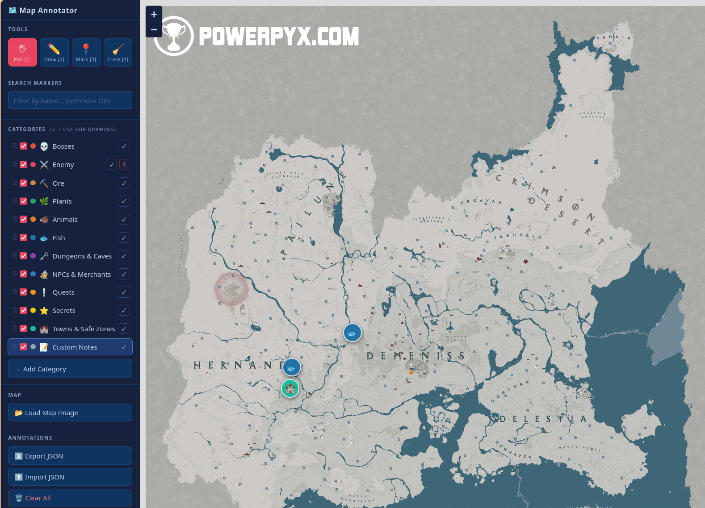

# 🗺️ Map Annotator

A self-contained, browser-based tool for annotating game maps. No installation, no server — just open `index.html`.

---

## Screenshot

> *Replace `screenshot.png` with your own screenshot placed in this folder.*

---

## Features

- **Freehand drawing** — pen tool with adjustable stroke width, color follows the active category
- **Markers** — place categorized icon markers with a label and optional notes
- **Categories** — built-in types plus fully custom categories with your own emoji and color
- **Reorderable category list** — drag rows to set your preferred order
- **Search** — filter visible markers by name; use `,` to search multiple names at once (OR)
- **Visibility toggles** — show/hide any category with a checkbox
- **Undo / Redo** — full history for strokes, markers, edits and deletes
- **Persistent storage** — annotations auto-save to `localStorage` and survive page reloads
- **Export / Import** — back up and share annotations as JSON
- **Custom map** — load any PNG or JPEG as your map image

---

## Getting Started

1. Open `index.html` in any modern browser (Chrome, Firefox, Edge).
2. Click **Load Map Image** and select your map file.
3. Pick a category from the sidebar, choose a tool, and start annotating.

---

## Tools

| Key | Tool | Description |
|-----|------|-------------|
| `1` | Pan | Navigate the map — click and drag |
| `2` | Draw | Freehand pen strokes |
| `3` | Mark | Click the map to place a named marker |
| `4` | Erase | Drag over strokes to remove them |
| `Esc` | — | Close modal or return to Pan |

---

## Keyboard Shortcuts

| Shortcut | Action |
|----------|--------|
| `Ctrl+Z` | Undo |
| `Ctrl+Y` / `Ctrl+Shift+Z` | Redo |
| `1` – `4` | Switch tool |
| `Esc` | Close modal / switch to Pan |

---

## Built-in Categories

| Emoji | Name |
|-------|------|
| 💀 | Bosses |
| ⛏️ | Ore |
| 🌿 | Plants |
| 🐗 | Animals |
| 🐟 | Fish |
| 🗝️ | Dungeons & Caves |
| 🧙 | NPCs & Merchants |
| ❕ | Quests |
| ⭐ | Secrets |
| 🏰 | Towns & Safe Zones |
| 📝 | Custom Notes |

Add your own via the **＋ Add Category** button at the bottom of the category list.

---

## Data & Privacy

All data stays on your machine. Nothing is sent to any server. Annotations are stored in your browser's `localStorage` under the key `cdmt_annotations`. Use **Export JSON** to create a portable backup.
